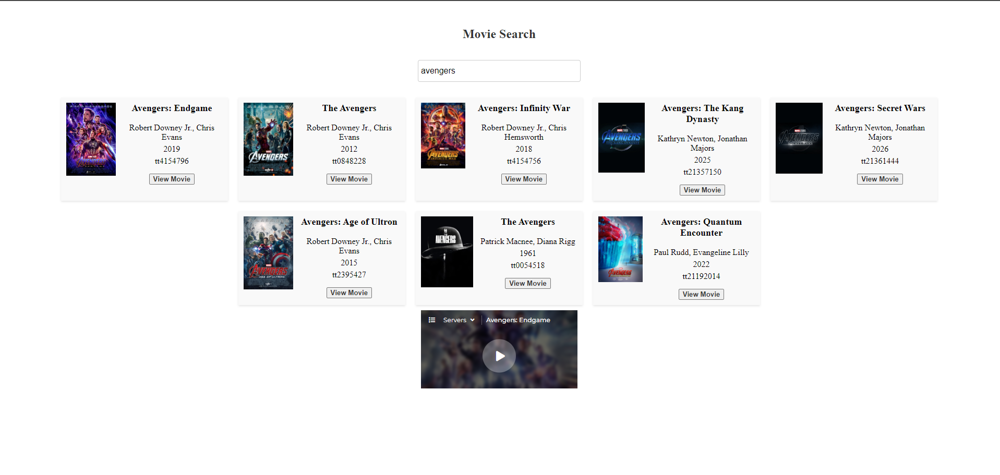

# IMDB-Movies

This repository contains a web application that allows users to search for movies and retrieve their corresponding details using the 2embed.to API. The website provides a user-friendly interface where users can enter the name of a movie they are interested in, and the application will fetch the movie details using the API.

## Important
To use this application, you will need to use a browser extension that enables CORS policies, such as the one shown in the image below. Otherwise, the page will not function properly.

I have noticed that if you do not have an extension that forces the page to load with https, such as "HTTPS Everywhere", it will not load the iframe of the movie, so I have added the url where you can see the movie.

## Example
This is an example where we search for the movie "Avengers" with the extension activated. We click on the "View Movie" button, and the movie will appear below, where we can enjoy it peacefully.

## Features
- **Movie Search**: Users can search for movies by entering the title of the movie they want to find.
- **API Integration**: The application integrates with the 2embed.to API to retrieve movie details, such as the title, release date, genre, and synopsis.
- **User Interface**: The website provides an intuitive user interface where users can interact with the search functionality and view the retrieved movie information.
- **Responsive Design**: The web application is designed to be responsive, ensuring a seamless experience across different devices and screen sizes.

## Technologies Used
- **HTML**: The structure of the web pages is built using HTML.
- **CSS**: CSS is used to style the web pages and ensure an appealing visual design.
- **JavaScript**: JavaScript is utilized to handle user interactions, fetch data from the 2embed.to API, and dynamically update the webpage content.
- **2embed.to API**: The API is integrated into the application to retrieve movie details based on user search queries.

## Getting Started
To run the application locally, follow these steps:

1. Clone this repository to your local machine.
2. Navigate to the project directory.
3. Open the `index.html` file in a web browser.
4. Use the search functionality to enter the movie title you want to search for.
5. The application will fetch the movie details from the 2embed.to API and display them on the webpage.

## Contribution
Contributions to this repository are welcome. If you have any suggestions or improvements, please submit a pull request. Additionally, feel free to open an issue if you encounter any bugs or have specific feature requests.

## Credits
This web application utilizes the 2embed.to API to retrieve movie details. Special thanks to the developers behind the 2embed.to API for providing the necessary functionality to make this project possible.

## License
This repository is licensed under the [MIT License](LICENSE). Feel free to modify and distribute the code as per the license terms.
